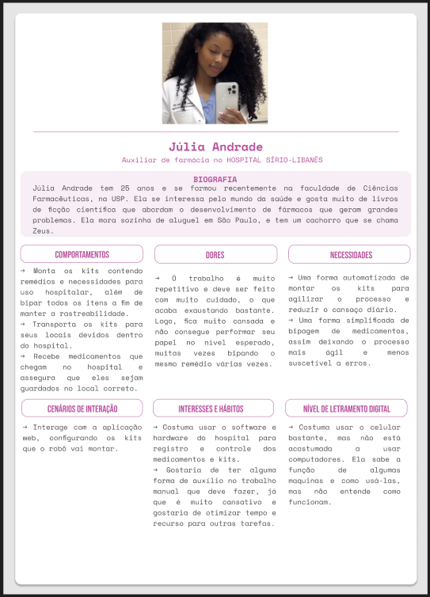

O projeto do módulo 5 do curso de engenharia de computação no Instituto de Tecnologia e Liderança tem como objetivo o desenvolvimento de um sistema de automação industrial.

Assim, em parceria com o Hospital Sírio-Libanês, o desafio consiste em automatizar e tornar mais seguro o processo de montagem de kits de reposição para os carrinhos de emergência para parada cardiorrespiratória. Após conversas com o parceiro, foi possível identificar os benefícios da implementação de um braço robótico para a montagem dos kits, como a redução do trabalho manual e a diminuição de erros por falta de atenção.

Para responder a atividade, foi um pedido do professor que as respostas fossem pensando no contexto do nosso projeto, então assim irei fazer.

Como foi citado acima, o ambiente predominante da nossa solução é a farmácia hospitalar, onde ficam os medicamentos e é realizada a montagem dos kits. As pessoas responsáveis por esse trabalho são os auxiliares de farmácia, que devem distribuir e bipar um a um todos os remédios e materiais que vão nos kits hospitalares. 

Dessa forma, a persona mais relevante que mapeei é justamente a figura do auxiliar de enfermagem, que irá interagir diretamente com o robô e com as interfaces que o envolvem. 

**Persona** - Julia Andrade

****Fonte:**** Elaborado por Gabrielle Dias Cartaxo

