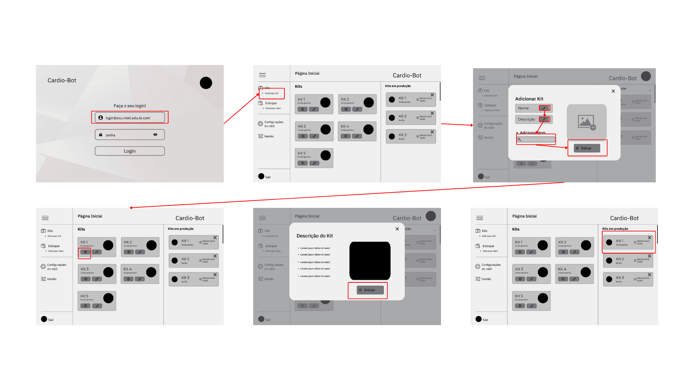

Seguindo as tarefas do usuário que foram apresentadas na seção anterior, segue o WireFlow que representa o passo a passo que a Júlia terá que cumprir para concluir essa tarefa.
Realizar o login, adicionar um kit e colocar ele em produção.

**Wireflow** - Adicionar kit e colocá-lo em produção

****Fonte:**** Elaborado por Gabrielle Dias Cartaxo

