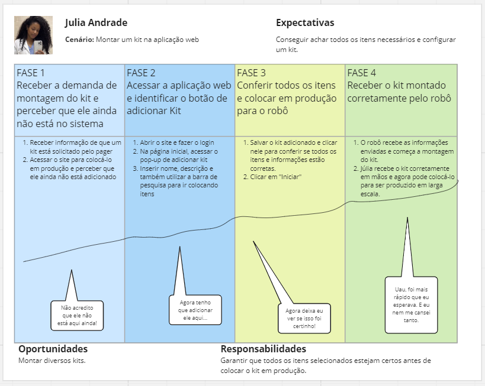

## Introdução

User stories são descrições curtas e simples de uma funcionalidade contada do ponto de vista do usuário final. Elas ajudam a focar no que é importante para o usuário, facilitando a priorização e a entrega de valor real. São úteis porque tornam claras as necessidades dos usuários, permitindo um desenvolvimento mais direcionado e eficiente. Dentro desse contexto, aqui apresentarei uma user storie que criei em relação à uma atividade muito importante para o funcionamento do projeto: Adicionar kits.

## Identificação - UH001

---

Importância – Alta.

---

Título – Adicionar Kit.

---

Persona – Júlia Andrade

---

Estimativa de esforço – Média.

---

História – Perceber que um kit ainda não foi adicionado e configurálo para colocar em produção.

---

Critério de aceitação - CA.01 – O kit foi salvo corretamente.

Validação – O card do kit apareceu na tela.

---

Testes de aceitação – CA.01 – a) É possível colocar o kit em produção.

Aconteceu: Sim, o kit foi para a produção.

Não aconteceu: Não foi para a produção, há um erro.

CA.01 - b) Os dados foram salvos corretamente. 

Aconteceu: Sim, é possível visualizar o card do kit na tela e os dados inseridos permanecem como configurados.

---

Uma representação visual dessa jornada pode ser vista abaixo:

**User journey** - Júlia Andrade

****Fonte:**** Elaborado por Gabrielle Dias Cartaxo

