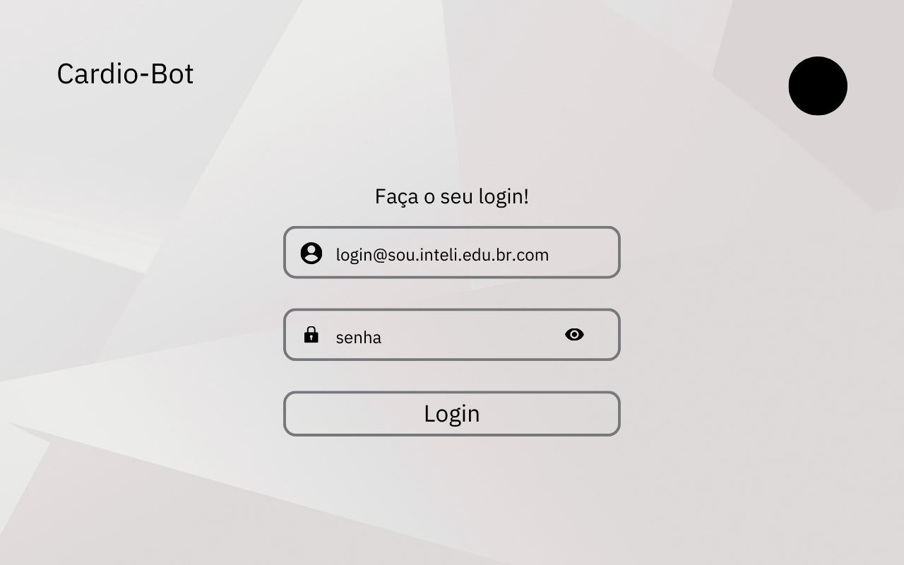
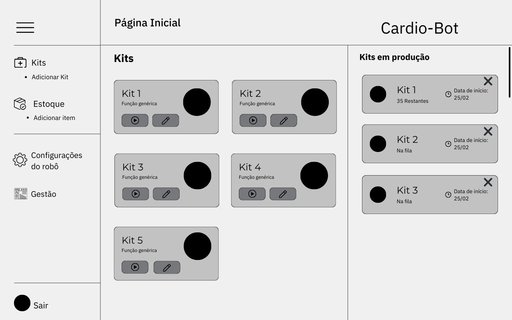
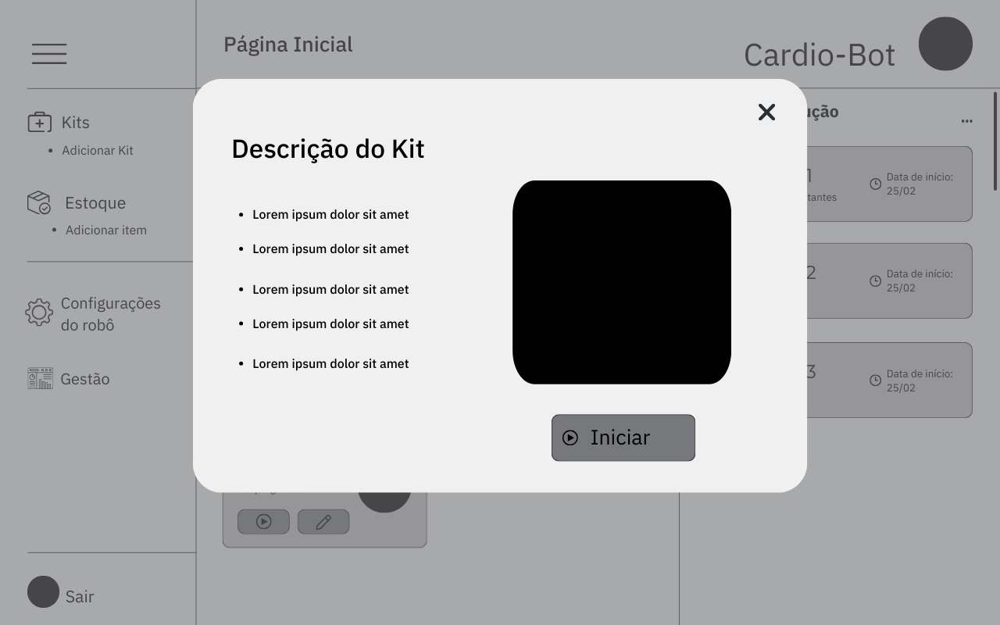

# Wireframe da Interface do Usuário

Um wireframe é uma representação visual de uma interface, utilizada nas fases iniciais de design, nesse caso, de uma aplicação web. São úteis para a validação das features que serão necessárias no projeto, além de gerar debates a fim de maximizar a satisfação do usuário final, pois o fluxo de utilização é fortemente considerado e planejado.
Aqui, eu utilizei o wireframe que desenvolvemos para o nosso projeto, mas irei apresentar apenas algumas páginas dele que são importantes para a user storie que citei anteriormente.

Tela inicial do site, onde a Júlia terá que fazer login:

**Tela 1** - Login

**Fonte:** Elaborado pela equipe Cardio-Bot

Tela principal do site, onde ela pode acessar o link de "Adicionar Kit" no menu lateral:

**Tela 2** - Tela principal

**Fonte:** Elaborado pela equipe Cardio-Bot

Tela na qual a Júlia poderá adicionar o kit, incluindo nome, descrição e itens:

**Tela 3** - Adicionar Kit

**Fonte:** Elaborado pela equipe Cardio-Bot

Tela final de confirmação antes de colocar o kit em produção:

**Tela 4** - Confirmar kit

**Fonte:** Elaborado pela equipe Cardio-Bot

